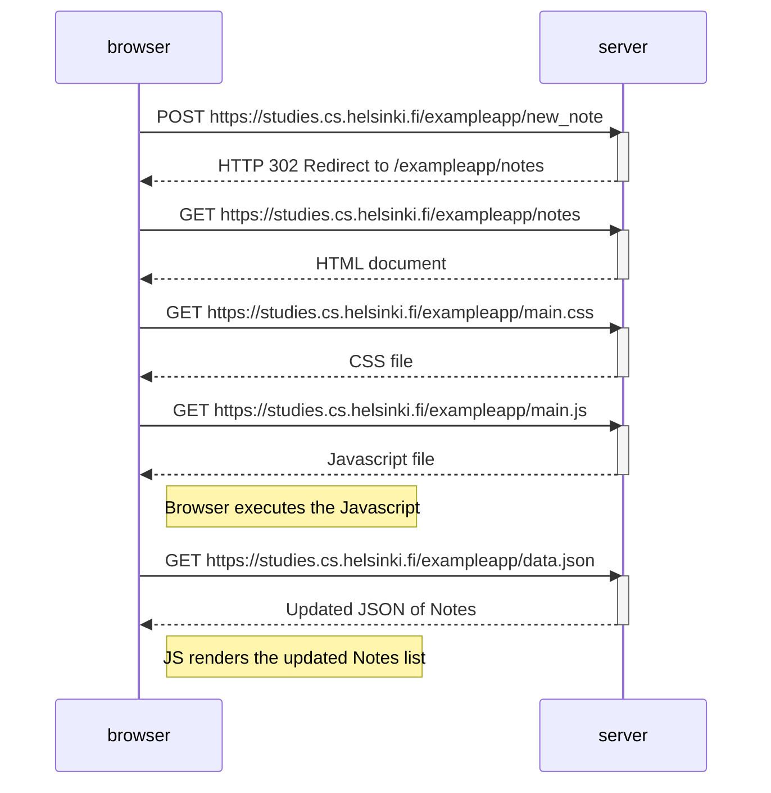

```mermaid
sequenceDiagram
  participant browser
  participant server

  browser ->> server: POST https://studies.cs.helsinki.fi/exampleapp/new_note
  activate server
  server -->> browser: HTTP 302 Redirect to /exampleapp/notes
  deactivate server

  browser ->> server: GET https://studies.cs.helsinki.fi/exampleapp/notes
  activate server
  server -->> browser: HTML document
  deactivate server

  browser ->> server: GET https://studies.cs.helsinki.fi/exampleapp/main.css
  activate server
  server -->> browser: CSS file
  deactivate server

  browser ->> server: GET https://studies.cs.helsinki.fi/exampleapp/main.js
  activate server
  server -->> browser: Javascript file
  deactivate server

  Note right of browser:  Browser executes the Javascript

  browser ->> server: GET https://studies.cs.helsinki.fi/exampleapp/data.json
  activate server
  server -->> browser: Updated JSON of Notes
  deactivate server

  Note right of browser: JS renders the updated Notes list
```
