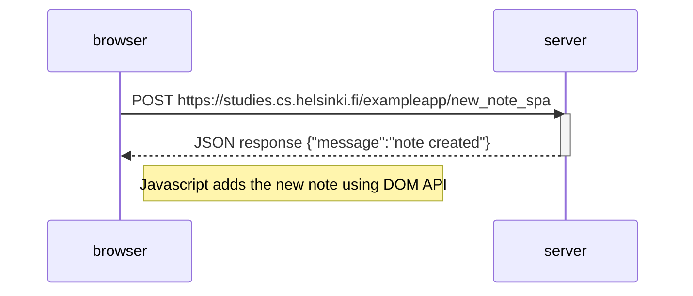

```mermaid
sequenceDiagram
    participant browser
    participant server

    browser ->> server: POST https://studies.cs.helsinki.fi/exampleapp/new_note_spa
    activate server
    server -->> browser: JSON response {"message":"note created"}
    deactivate server

    Note right of browser: Javascript adds the new note using DOM API
```
